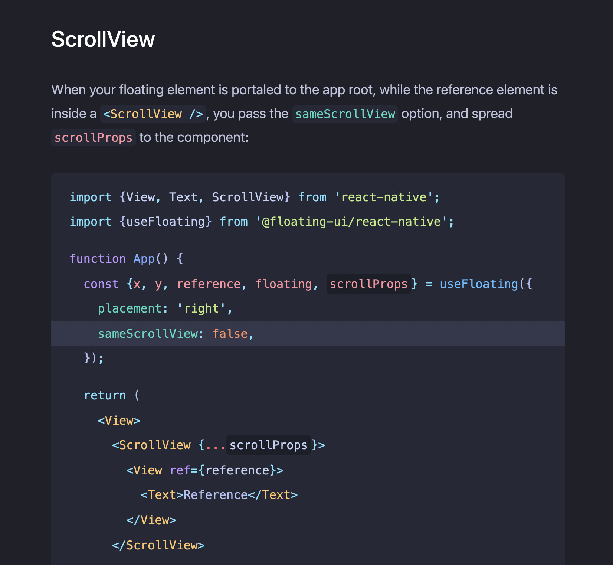

# MDX Pretty Code

<p align="center">

</p>

A Remark plugin to make the code in your MDX docs simply beautiful. Powered by
[Shiki](https://github.com/shikijs/shiki).

- ✅ Perfect VS Code highlighting (use any theme)
- ✅ Line and word highlighting
- ✅ Context-adjustable inline code highlighting

## Installation

```shell
npm install @atomiks/mdx-pretty-code shiki
```

## Usage

CommonJS is also supported.

```js
import {createRemarkPlugin} from '@atomiks/mdx-pretty-code';
import fs from 'fs';

const prettyCode = createRemarkPlugin({
  // Options passed to shiki.getHighlighter()
  shikiOptions: {
    // Link to your VS Code theme JSON file
    theme: JSON.parse(
      fs.readFileSync(require.resolve('./themes/my-theme.json'), 'utf-8')
    ),
  },
  // These are hooks which allow you to style the node. `node` is an element
  // using JSDOM, so you can apply any CSS.
  onVisitLine(node) {
    // Style a line node.
    Object.assign(node.style, {
      margin: '0 -1.5rem',
      padding: '0 1.5rem',
    });
  },
  onVisitHighlightedLine(node) {
    // Style a highlighted line node.
    Object.assign(node.style, {
      backgroundColor: 'rgba(0,0,0,0.1)',
    });
  },
  onVisitHighlightedWord(node) {
    // Style a highlighted word node.
    Object.assign(node.style, {
      backgroundColor: 'rgba(0,0,0,0.5)',
      padding: '0.25rem',
      borderRadius: '0.25rem',
    });
  },
});
```

Then pass the plugin to your MDX `remarkPlugins` option. For example, in
`next.config.js` using MDX v2:

```js
module.exports = {
  experimental: {esmExternals: true},
  webpack(config, options) {
    config.module.rules.push({
      test: /\.mdx?$/,
      use: [
        options.defaultLoaders.babel,
        {
          loader: '@mdx-js/loader',
          /** @type {import('@mdx-js/loader').Options} */
          options: {
            remarkPlugins: [prettyCode],
          },
        },
      ],
    });

    return config;
  },
};
```

## API

Code blocks are configured via the meta string after the top codeblock fence.

### Line highlighting

Highlight lines 1, 2 through 4, and 6.

\`\`\`js {1,2-4,6}

### Word highlighting

Highlight the literal word `carrot`. Regex is not currently supported.

\`\`\`js /carrot/

#### Limit word highlighting to specific instances

If you want to limit which words get highlighted, this is possible. For
instance:

\`\`\`js /carrot/1-2,4

The numeric range must be directly after the `/`.

This will only highlight the first, second, and fourth instances of `carrot`,
but not the third, or fifth+.

### Inline highlighting

Append `{:lang}` (e.g. `{:js}`) at the end of the inline code to highlight it
like it's a regular code block.

```
This is `inline(){:js}` code which will be colored like a regular code block.
```

In your `MDXProvider`'s `components` prop, modify `span` like so:

```js
const mdxComponents = {
  span(props) {
    if (props['data-mdx-pretty-code'] != null) {
      return (
        <code style={{color: props['data-color']}}>
          {props.children.props.children}
        </code>
      );
    }

    return <span {...props} />;
  },
};
```

#### Context-specific highlighting

Shiki will color plain variables as plain text since the highlighting has no
context. But if you're referring to a variable which was colored a different way
by Shiki in a code block above or below the inline code, it won't be semantic.

You can instruct MDX Pretty Code to color a word by supplying a token whose
color is specified in the VS Code theme.

It must start with a `.` to indicate it's a token, not a language.

```
The function name is `hello{:.entity.name.function}`.
```

You can create a `tokensMap` to shorten this throughout your docs:

```js
createRemarkPlugin({
  // ...
  tokensMap: {
    function: 'entity.name.function',
  },
});
```

Now you can just do:

```
The function name is `hello{:.function}`.
```

> Note: for the token feature to work, you must have supplied a JSON object to
> `shikiOptions.theme`, not a default Shiki theme string.

## Sanitizing

All HTML is sanitized via
[`sanitize-html`](https://www.npmjs.com/package/sanitize-html). To configure the
sanitizing options, pass `sanitizeOptions`, which is 1:1 with its API.

## License

MIT
