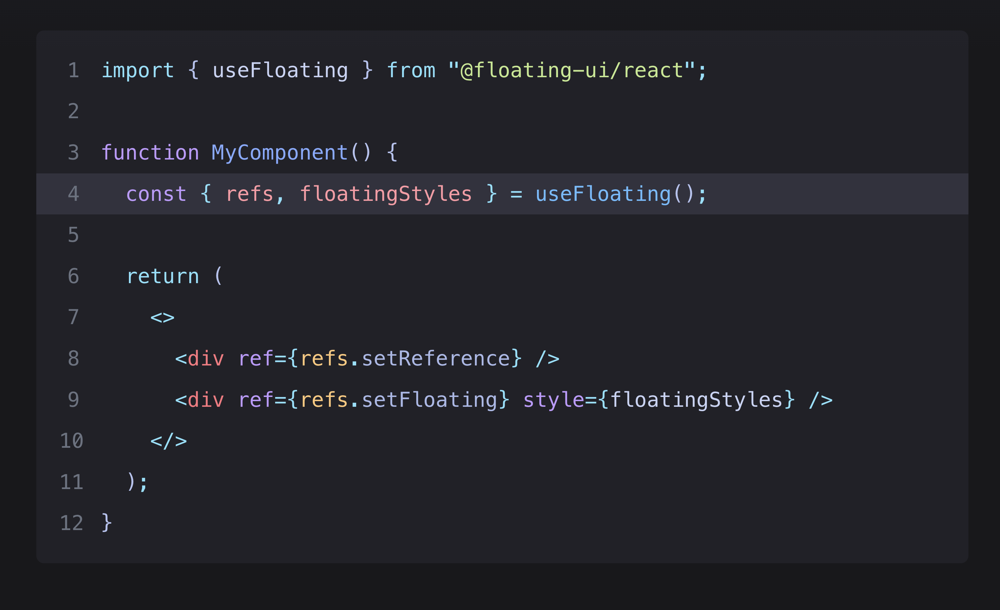

  

<h1 align="center" style="font-size: 2.8rem; font-weight: 900; color: white;">Rehype Pretty Code</h1>

Beautiful code blocks for your MD/MDX docs.

[View website for documentation](https://rehype-pretty.pages.dev)

## Integration Examples

|    [SvelteKit](./examples/sveltekit) |    [Astro](./examples/astro) |    [CDN](./examples/cdn) |
|---|---|---|

